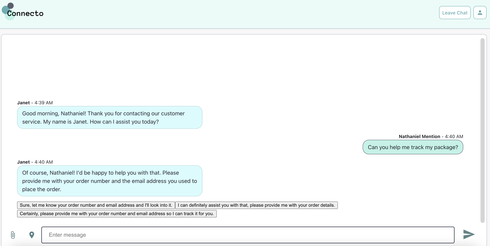

# connecto

## Table of contents

- [Introduction](#Introduction)
- [Design](#Design)
- [Features](#Features)
- [Technologies](#Technologies)
- [Setup](#Setup)
- [Credits](#Credits)

## Introduction

Omnichannel messaging platform for businesses

## Design




## Features

A few things that you can do on connecto:

- Securely authenticate and log in as a customer or administrator to access the platform
- Effortlessly communicate with the administrator by sending and receiving email messages directly within the application
- Seamlessly connect with others via an in-app messaging system for real-time chat and collaboration
- Conveniently locate and share live location information with ease
- Capture moments and share them with others by taking and uploading photos directly within the platform
- Quickly reach out to the administrator by sending messages directly to their phone number from within the application

## Technologies

- [Express](https://expressjs.com/)
- [NodeJS](https://nodejs.org/en/)
- [React](https://reactjs.org/)
- [PostgreSQL](https://www.postgresql.org/)
- [TypeScript](https://www.typescriptlang.org/)
- [Amazon Web Services](https://docs.aws.amazon.com/iam/index.html?nc2=h_ql_doc_iam)

## Setup

Clone or download the repository:

`git clone https://github.com/NathanielMention/connecto`

In the backend directory:

Before you get started, you might want to download [pnpm](https://pnpm.io/) if you haven’t already. This project has not been tested with NPM or Yarn.

First, install dependencies:

```
pnpm install
```

Then, create a `.env` file in the root directory of the project. You can use the `.env.example` file as a template:

```
cp .env.example .env
```

You’ll want to generate random, 32-character strings for both the `SESSION_SECRET` and `JWT_SECRET` variables. You can use [this tool](https://1password.com/password-generator/) to generate those values.

Next, set up the database:

```
pnpm exec prisma db push
```

For now, we’re using a SQLite database stored locally on your machine. In the future, we’ll switch to a cloud database.

Finally, start the development server:

```
pnpm dev
```

To run tests:

```
pnpm test
```

In the frontend directory:

First, install dependencies:

```
pnpm install
```

Finally, start the frontend:

```
pnpm dev
```

## Credits

Geocoding and location services powered by [Google Maps](https://mapsplatform.google.com/maps-products/#geocoding)

Customer service chat bot powered by [GPT-3.5](https://platform.openai.com/docs/guides/chat)
